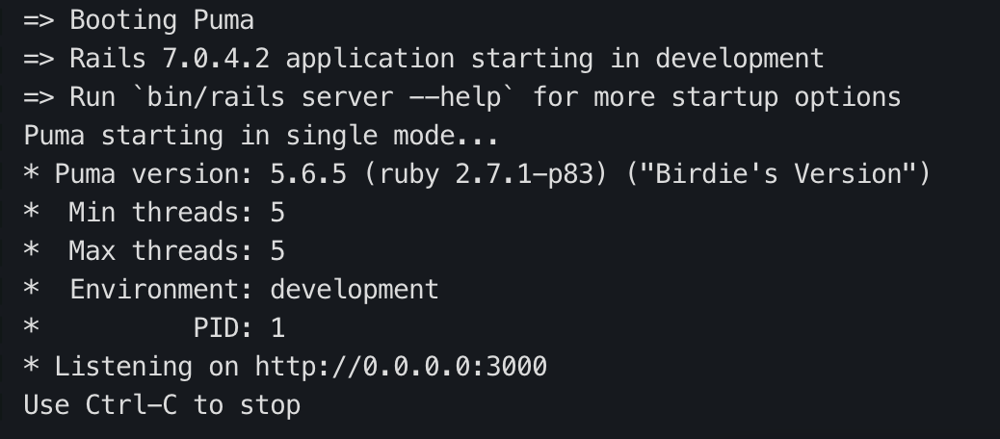
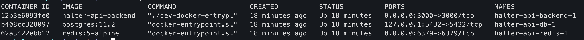

# Halter API

This is an API to Challenge to apply as a Software Engineer in Halter

## Installation Requirements

You will need to have Docker and `docker-compose` available in your system.


## Run the application

1. To run this project you have to execute the build and compose command

```bash
  $ docker-compose up --build
```

This command run the 3 services that exist `backend` (The ruby application), `bd` (Postgres) and `redis`.

You must wait until see as image below:



After that check is running, go to your browser and visit: http://localhost:3000.

For the other times to run you can just run: 
```bash
  $ docker-compose up
```

&nbsp;

### HTTP Calls

This project contain a collection to import in postman [ Halter Collection](./Halti%20Test.postman_collection.json). 

1. Create a Cow: [GET] http://localhost:3000/cows/#{cow.id} 
 > The body must contain into the form data:
 >  <br>
 >  `cow[collarId]="some-id"`
 > <br>
 > `cow[cowNumber]="some-number"`
2. Update a Cow: [PATCH] http://localhost:3000/cows/#{cow.id} 
> The body must contain into the form data:
 >  <br>
 >  `cow[collarId]="some-id"`
 > <br>
 > `cow[cowNumber]="some-number"`
 3. List Cows: [GET] http://localhost:3000/cows
 > NOTE: This request take a more time comparing the other request. This is because for each call needs to call an external API.
 

&nbsp;
&nbsp;
&nbsp;

## [Optional] For execute testing

For testing you need to enter to the bash container and run the test command. 

1. Check the docker ID for backend image: 

```bash
  $ docker ps
```



2. Get the <strong>container ID</strong> of `halter-api-backend` and then run the command: 
```
  $ docker exec -ti CONTAINER-ID bash
```
3. Inside the container bash, you can run:
```
  $ rails test
``` 